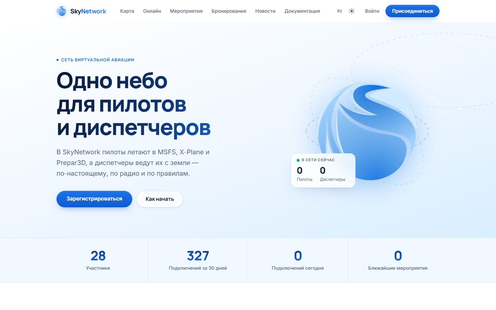
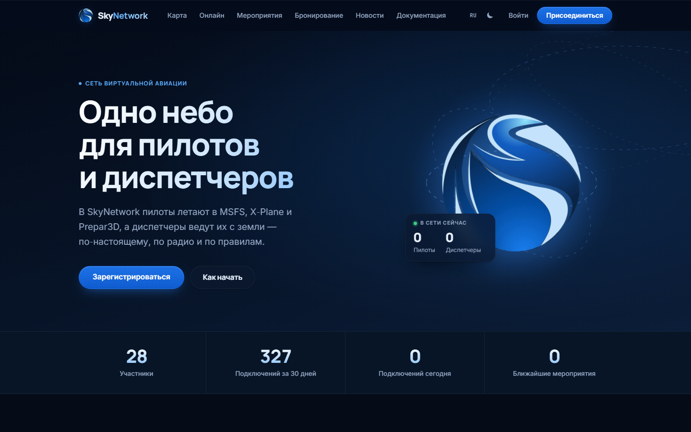
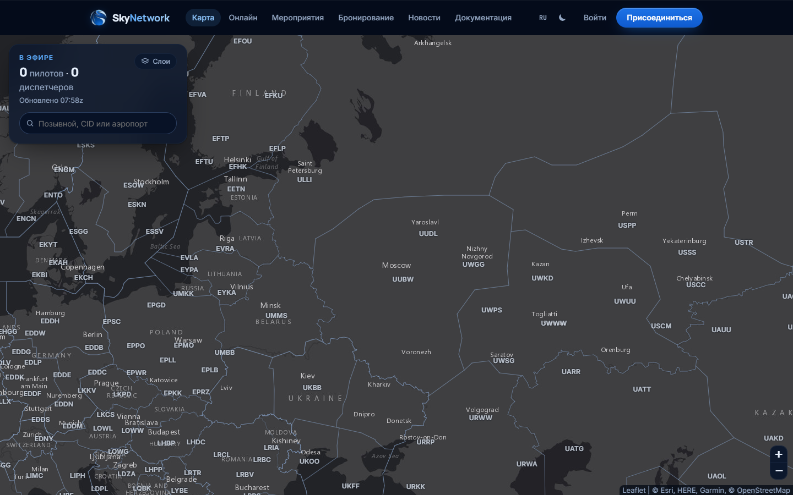
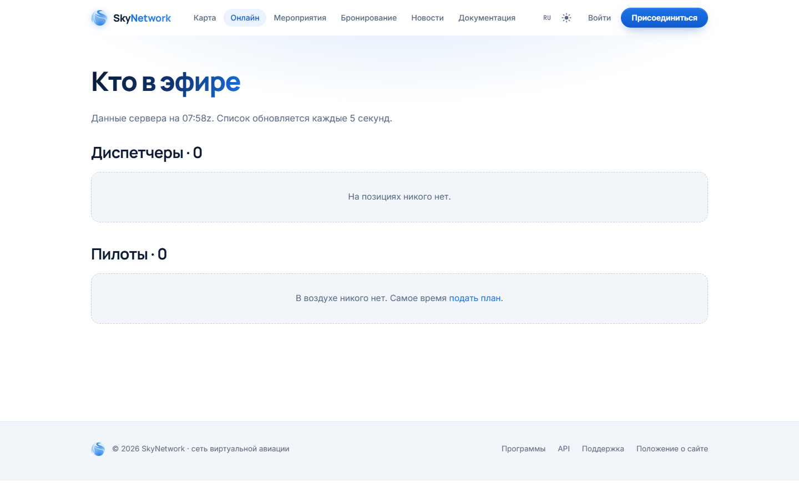

<div align="center">
  
  <h1>SkyNetwork — сайт сети</h1>
  <p>Веб-сайт виртуальной авиационной сети: карта, профили, события, новости, бронирования и зона персонала.</p>

  [](https://github.com/chatgpt82628163-pixel/SkyNetwork-site/actions/workflows/ci.yml)

  [Сайт](https://sky.network.npzy2.us) · [Поддержка](https://sky.network.npzy2.us/support)
</div>

---

## Что это

SkyNetwork-site — сайт виртуальной авиационной сети, написанный на ASP.NET Core 8 (Razor Pages). Он работает с той же базой SQLite, что и сервер FSD, поэтому учётная запись создаётся один раз и используется везде. Сайт отдаёт данные об онлайне в реальном времени, предоставляет публичный JSON-API и реализует OAuth 2.0 — SkyNetwork Connect — для входа на сайты дивизий.

## Возможности

### Онлайн и карта

- **Карта** — интерактивная карта с положением воздушных судов, трассами из SimBrief и аэропортовыми схемами (OpenStreetMap). Тайлы проксируются на сервере.
- **Список онлайна** — пилоты и диспетчеры с позывными, маршрутом и рейтингом; данные обновляются раз в 5 секунд.

### Участники

- Регистрация и вход; подтверждение адреса почты; восстановление пароля.
- Профиль участника: рейтинги пилота, диспетчера и военного пилота, часы налёта и работы, история сессий.
- Список участников с поиском и фильтрами.
- Список друзей и уведомления.

### Контент

- **Новости** — публикация на русском и английском, архив.
- **События** — карточки с описанием и бронированием позиций (Bookings).
- **Бронирования** — резервирование диспетчерских позиций с указанием времени.
- **Флайт-план** — отправка плана полёта из браузера; интеграция с SimBrief.

### API и интеграции

- **Публичный JSON-API** (`/api/v1/`) — онлайн, участники, события, новости, бронирования, METAR, декодирование маршрутов. Без ключа, CORS открыт.
- **SkyNetwork Connect** — OAuth 2.0 (authorization code, PKCE) для сайтов дивизий. Участник входит один раз; сторонний сайт получает имя, рейтинг и опционально почту.
- **Division API** (`/api/division/v1/`) — аутентифицированный API для академий дивизий: запрос на повышение рейтинга.
- **SkyPilot API** — авторизация клиента и последний флайт-план.

### Зона персонала

Доступна только с ролью staff; поисковики не индексируют. Включает управление участниками, тикетами поддержки, событиями, новостями, аудитом, рейтингами и настройку дивизий. Страница статуса с журналом ошибок последних суток.

### Прочее

- Два языка: русский и английский. Переключатель в шапке, выбор сохраняется в cookie на год.
- Светлая и тёмная тема.
- Кэширование тайлов и загружаемых файлов.

## Скриншоты

<table>
  <tr>
    <td></td>
    <td></td>
  </tr>
  <tr>
    <td align="center">Главная — светлая тема</td>
    <td align="center">Главная — тёмная тема</td>
  </tr>
</table>

| Карта | Онлайн |
|---|---|
|  |  |

## Сборка и запуск

**Требования:** .NET 8 SDK (или новее — проект содержит `<RollForward>Major</RollForward>`).

```bash
# Сборка
dotnet build -c Release

# Запуск тестов
dotnet test -c Release

# Публикация
dotnet publish src/SkyNetwork.Site -c Release -o publish

# Запуск
dotnet publish/SkyNetwork.Site.dll
```

Сайт поднимается на `http://0.0.0.0:8000` (значение `Urls` в `appsettings.json`).

### Основные настройки (`appsettings.json → Site`)

| Ключ | Что делает |
|---|---|
| `Database` | Путь к файлу SQLite (по умолчанию `skynetwork.db`) |
| `DataFeedUrl` | URL фида FSD-сервера (`/data.json`) |
| `FeedPollSeconds` | Интервал опроса фида (5 с) |
| `FsdHost` / `FsdPort` | Адрес и порт FSD-сервера |
| `BehindProxy` | Включить форвардинг заголовков X-Forwarded-* |
| `AuthAttemptsPerMinute` | Лимит попыток входа с одного адреса |

Секретные значения (пароль почты, ключи клиентов OAuth) в репозиторий не попадают — задаются через `appsettings.Production.json` или переменные окружения.

## Устройство

```
src/SkyNetwork.Site/
  Api/              — JSON-API, SkyNetwork Connect, Division API, SkyPilot
  Data/             — модели, сервисы, миграции базы данных
  Localization/     — поддержка русского языка (Lang, Ru)
  Nav/              — данные о точках и воздушных трассах
  Pages/            — Razor Pages: карта, онлайн, участники, события и т. д.
    Account/        — личный кабинет
    Events/         — список событий и детали
    Members/        — список участников и профили
    News/           — новости
    Oauth/          — страница авторизации Connect
    Staff/          — зона персонала
    Docs/           — документация, API, программное обеспечение
  Security/         — аутентификация, аудит
  Services/         — фоновые сервисы: фид, почта, здоровье
  wwwroot/          — статика: CSS, JS, иконки
tests/SkyNetwork.Site.Tests/  — интеграционные тесты
deploy/                       — конфиги Nginx и systemd-сервисов
```

## Часть SkyNetwork

| Репозиторий | Описание |
|---|---|
| [SkyNetwork-site](https://github.com/chatgpt82628163-pixel/SkyNetwork-site) | Этот сайт |
| [SkyNetwork-FSD](https://github.com/chatgpt82628163-pixel/SkyNetwork-FSD) | Сервер FSD |
| [Network-ATC](https://github.com/chatgpt82628163-pixel/Network-ATC) | Клиент диспетчера |
| [SkyPilot](https://github.com/chatgpt82628163-pixel/SkyPilot) | Клиент пилота |
| [Skynetwork-voice](https://github.com/chatgpt82628163-pixel/Skynetwork-voice) | Голосовой сервер |
| [SkyRUS-site](https://github.com/chatgpt82628163-pixel/SkyRUS-site) | Сайт дивизии SkyRUS |
| [Skynetwork-bot](https://github.com/chatgpt82628163-pixel/Skynetwork-bot) | Discord-бот |

---

## English

**SkyNetwork** is the website for a virtual aviation network, built with ASP.NET Core 8 Razor Pages, Dapper, and SQLite. The site shares the same database as the FSD server, so members register once and use the same credentials everywhere.

**Features:** live map with aircraft positions and SimBrief routes · online pilot and controller list · member profiles with ratings and hours · news, events, and position bookings · flight plan filing · staff area · public read-only JSON API · SkyNetwork Connect (OAuth 2.0 sign-in for division sites) · Division API for academy rating upgrades · Russian and English · light and dark theme.

**Build:**
```bash
dotnet build -c Release
dotnet test -c Release
dotnet publish src/SkyNetwork.Site -c Release -o publish
```
Requires .NET 8 SDK or later. The site listens on `http://0.0.0.0:8000` by default; set `Site:Database` to point at your SQLite file and `Site:DataFeedUrl` to the FSD server's data feed.

**Links:** [Site](https://sky.network.npzy2.us) · [Support](https://sky.network.npzy2.us/support)
